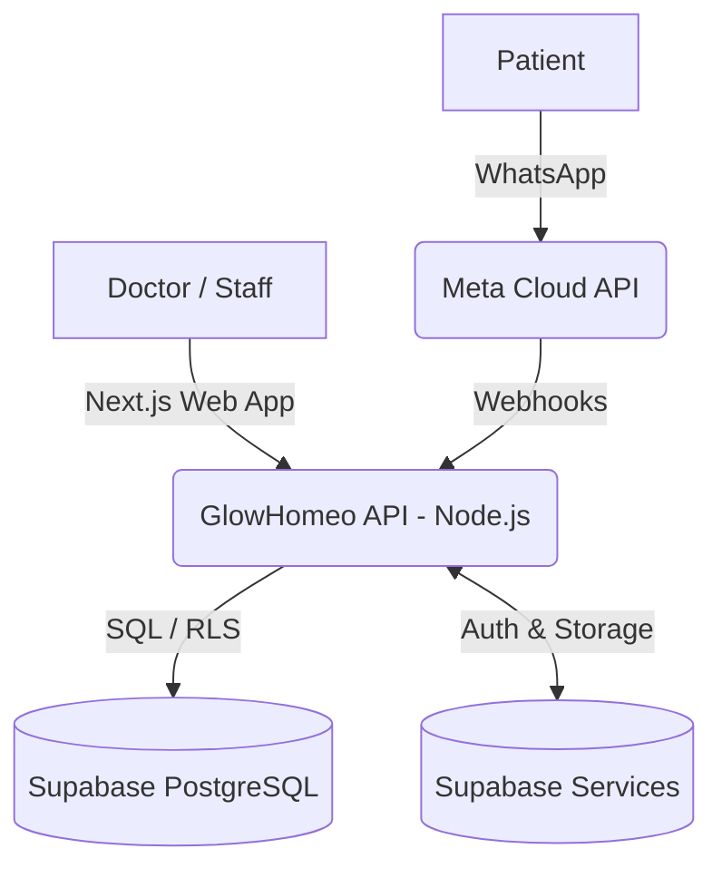

# System Architecture

GlowHomeo employs a decoupled, highly scalable architecture tailored for clinic operations and WhatsApp-first patient engagement.

## High-Level Topology

## Layers
1. **Presentation Layer:** Next.js React frontend deployed on Vercel/Railway. Uses Tailwind CSS and a bespoke UI system.
2. **API Layer:** Node.js Express backend implementing RESTful endpoints, webhook receivers, and scheduled background workers.
3. **Data Layer:** PostgreSQL hosted on Supabase, enforcing multi-tenancy strictly at the database level via Row Level Security (RLS).
4. **Engagement Layer:** Integration with Meta's official WhatsApp Business API for dual-channel routing (Automated vs. Clinical).
