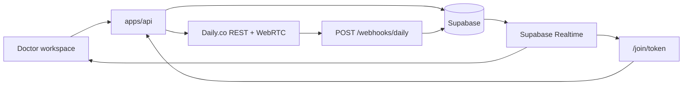

# Daily.co telemedicine runbook

Enterprise video consultations for HomeoAssist using [Daily.co](https://www.daily.co/) as the embedded engine. Jitsi has been fully replaced.

## Architecture



**Security model**

1. Patient receives `/join/{uuid}` (72–96h token in `patient_access_tokens`).
2. Public join resolves token → mints short-lived Daily meeting token (≤2h, room-scoped).
3. Doctor uses owner token; patient uses knocking token until admitted.

## Environment variables

| Variable | Required | Purpose |
|----------|----------|---------|
| `DAILY_API_KEY` | Yes | REST API + meeting token minting |
| `DAILY_DOMAIN` | Yes | e.g. `yourclinic.daily.co` |
| `DAILY_WEBHOOK_SECRET` | Prod | Webhook auth (`X-Webhook-Secret` or HMAC signature) |
| `DAILY_ROOM_PREFIX` | No | Room name prefix (default `GlowHomeo`) |
| `DAILY_MEETING_TOKEN_TTL_SEC` | No | Token lifetime (default `7200`) |
| `DAILY_RECORDING_WEBHOOK_SECRET` | No | Manual recording ingest fallback |
| `MISSED_CONSULTATION_GRACE_MIN` | No | Minutes after slot before no-show (default `20`) |
| `APP_PUBLIC_URL` | Yes | Patient join links |

## Database migration

Apply:

```bash
supabase db push
```

File: `supabase/migrations/20260529000000_daily_video_sessions.sql`

- Extends `video_sessions` with lifecycle columns
- Adds `consultation_events` audit trail
- Adds `appointments.missed_at`, `no_show_notified_at`
- Enables Realtime on `video_sessions`

## API endpoints

| Method | Path | Auth | Purpose |
|--------|------|------|---------|
| GET | `/public/join/:token` | Public | Patient join (scheduled / live + Daily token) |
| GET | `/doctor/consultations/:id/meeting` | Doctor | Room URL + meeting token + status |
| GET | `/doctor/consultations/:id/video-session` | Doctor | Full session state + patient link |
| POST | `/doctor/consultations/:id/provision-video` | Doctor | Create Daily room |
| POST | `/doctor/consultations/:id/admit-patient` | Doctor | Admit knocking patient |
| POST | `/webhooks/daily` | Secret | Participant / meeting / recording events |
| POST | `/webhooks/daily/recording` | Secret | Manual recording ingest |

## Daily.co dashboard setup

1. Create a Daily domain and API key.
2. Register webhook URL: `https://api.{your-domain}/webhooks/daily`
3. Subscribe to: `participant.joined`, `participant.left`, `meeting.started`, `meeting.ended`, `recording.ready-to-download`
4. Set `DAILY_WEBHOOK_SECRET` to match your verification header.

## Session lifecycle

```
PROVISIONED → LIVE (doctor joins) → ENDED
              ↘ patient knocking → admit → LIVE
```

Events are written to `consultation_events` and state is synced via Supabase Realtime.

## Notifications

| Topic | Trigger |
|-------|---------|
| `consultation_ready_whatsapp` | Doctor joins room |
| `consultation_missed_whatsapp` | No doctor join after grace period |
| Existing invite/reminder/summary/Rx topics | Unchanged |

WhatsApp template slugs: `telemedicine_consultation_ready`, `telemedicine_consultation_missed` (sync via Settings → WhatsApp).

## Production readiness checklist

- [ ] Migration `20260529000000_daily_video_sessions.sql` applied
- [ ] Realtime enabled on `video_sessions` (migration handles publication)
- [ ] `DAILY_API_KEY`, `DAILY_DOMAIN`, `DAILY_WEBHOOK_SECRET` configured
- [ ] `APP_PUBLIC_URL` matches deployed Next.js origin (HTTPS)
- [ ] Daily webhook registered and verified
- [ ] Book ONLINE appointment → invite jobs in `notification_jobs`
- [ ] Doctor starts ONLINE consult → Daily embed in context drawer
- [ ] Patient `/join/{token}` → waiting room → admit → video
- [ ] Finalize consult → Rx WhatsApp/email
- [ ] Reminders T-24h / T-1h fire correctly
- [ ] Reschedule appointment → reminders regenerated; cancel → jobs cancelled
- [ ] Missed consult job runs (default every 15 min)
- [ ] Recording webhook → S3 → doctor download
- [ ] Daily plan supports expected concurrent rooms
- [ ] BAA / HIPAA requirements confirmed with Daily for your plan tier

## Frontend components

| Component | Path |
|-----------|------|
| Doctor embed | `apps/web/components/clinic/video/DailyConsultationVideo.tsx` |
| Call surface | `apps/web/components/clinic/video/DailyCallSurface.tsx` |
| Patient join | `apps/web/app/join/[token]/page.tsx` |
| Realtime hook | `apps/web/lib/use-video-session-realtime.ts` |

## Backend modules

| Module | Path |
|--------|------|
| Daily REST client | `apps/api/src/modules/telemedicine/daily/dailyClient.ts` |
| Meeting orchestration | `apps/api/src/modules/telemedicine/meetingService.ts` |
| Webhook handler | `apps/api/src/modules/telemedicine/dailyWebhookHandler.ts` |
| Missed consult worker | `apps/api/src/modules/telemedicine/missedConsultationJob.ts` |
