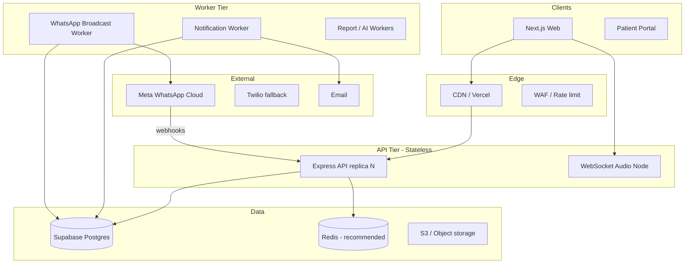

# Enterprise Architecture — HomeoAssist Clinic Platform

**Version:** 2026-05-22  
**Target scale:** 200+ active patients / doctor, 500+ completed consultations, 10k+ WhatsApp messages/day/clinic, multi-doctor clinics, future multi-clinic.

---

## 1. Architecture overview



**Design principles**

- **Clinic-scoped isolation** — RLS + `clinic_id` on all clinical tables.
- **Denormalize for reads** — `patients.last_visit_at`, `follow_up_status`, `visit_count` maintained by triggers.
- **Slim list APIs** — pagination + `lightweight` + timeline `includeNotes=false` by default.
- **Queue safety** — `claim_notification_jobs()` with `FOR UPDATE SKIP LOCKED`.
- **Separate poll loops** — general notifications vs `whatsapp_broadcast` topics.

---

## 2. Phase 1 — Database (implemented)

| Item | Migration | Notes |
|------|-----------|-------|
| Patient metrics | `20260522000000_enterprise_scalability.sql` | `visit_count`, `active_consult_count`, `last_prescription_at`, `follow_up_status` |
| Triggers | `refresh_patient_metrics()` | On consultation end / prescription insert |
| Timeline index | `idx_consult_patient_timeline` | `(patient_id, clinic_id, started_at DESC)` |
| Queue RPC | `claim_notification_jobs` | SKIP LOCKED, topic filter |
| Webhook store | `whatsapp_webhook_events` | Delivery/read/template events |
| Consent log | `messaging_consent_log` | India compliance trail |

**Apply migrations**

```bash
supabase db push
# or run SQL in Supabase dashboard
```

---

## 3. Phase 2 — Backend (implemented)

| Module | Path | Purpose |
|--------|------|---------|
| Patient list | `apps/api/src/modules/patients/patientListService.ts` | Paginated, cursor, SQL `follow_up_status` filter |
| Timeline | `apps/api/src/modules/patients/timelineService.ts` | Paginated, slim consult rows |
| My Day | `apps/api/src/modules/myDay/myDayService.ts` | Batch patient name lookups |
| Job queue | `apps/api/src/modules/jobs/jobQueue.ts` | Claim, backoff, dead-letter |
| Observability | `apps/api/src/lib/observability.ts` | Span timing + queue metrics |
| WhatsApp webhook | `apps/api/src/modules/whatsapp/webhookHandler.ts` | Meta delivery/read |
| Credential vault | `apps/api/src/modules/whatsapp/credentialVault.ts` | AES-256-GCM tokens |

**API changes**

| Endpoint | New behavior |
|----------|----------------|
| `GET /doctor/patients` | `cursor`, `sort`, `lightweight`, `nextCursor` |
| `GET /doctor/patients/search` | Palette-optimized (≤25 rows) |
| `GET /doctor/patients/:id/timeline` | `limit`, `offset`, `includeNotes`, `hasMore` |
| `GET /doctor/consultations/:id/note-detail` | Lazy note JSON |
| `GET/POST /webhooks/meta/whatsapp` | Webhook verify + events |

**Worker env**

```env
WORKER_MODE=all|notifications-only|whatsapp-only
NOTIFICATION_BATCH_LIMIT=50
WHATSAPP_BATCH_LIMIT=30
WHATSAPP_SEND_INTERVAL_MS=1000
WHATSAPP_TOKEN_ENCRYPTION_KEY=<32+ char secret>
META_WEBHOOK_VERIFY_TOKEN=<random>
```

---

## 4. Phase 3 — Frontend (implemented)

| Change | Path |
|--------|------|
| Virtualized list | `apps/web/components/platform/VirtualizedList.tsx` |
| Timeline pagination | `patients/[id]/timeline/page.tsx` |
| Light patient search | `searchPatientsLight()` + command palette |
| Dashboard roster cap | `HomeOverview` — 8 patients, not 500 |

**Recommended next**

- Route-level `dynamic()` for `LiveConsultationClient`
- Web Vitals reporting (`web-vitals` → analytics)
- Expand note lazy-load in `Timeline.tsx` on consult row expand

---

## 5. Phase 4 — WhatsApp enterprise (partial)

| Feature | Status |
|---------|--------|
| Per-doctor Meta connection | Done |
| Bulk broadcast + queue | Done |
| Personalization variables | Done (+ appointment_date, prescription_link, followup_date) |
| Audience filters | Done (+ inactiveDaysMin, lastVisitWithinDays) |
| Webhooks delivery/read | Done |
| Token encryption at rest | Done (env key) |
| Meta Embedded Signup OAuth | **Done** — Settings → Connect with Meta + manual fallback |
| Template sync from Meta | **Done** — `POST /doctor/whatsapp/templates/sync` + auto-sync on connect |
| DLT SMS fallback | **Planned** |
| Campaign pause/resume | Schema `paused_at` — API TBD |

---

## 6. Phase 5 — Production infrastructure (recommended)

### Horizontal scaling

| Service | Replicas | Notes |
|---------|----------|-------|
| `apps/api` | 2–8 | Stateless; disable in-process workers when using dedicated workers |
| `worker-notifications` | 1–4 | `WORKER_MODE=notifications-only` |
| `worker-whatsapp` | 2–8 | `WORKER_MODE=whatsapp-only`; scale with broadcast volume |
| `worker-audio-wss` | 1–2 | Sticky sessions or dedicated audio subdomain |

### Redis (recommended)

- **Rate limits** — per doctor/clinic/endpoint (token bucket)
- **Job delay queue** — optional replacement for DB poll at very high volume
- **Session cache** — workspace context, feature flags
- **Realtime** — pub/sub for multi-instance WSS coordination

### CDN / media

- Prescription PDFs via signed S3 URLs + CloudFront
- `Cache-Control` on static Next assets

### Monitoring stack

| Tool | Use |
|------|-----|
| **OpenTelemetry** | Trace API → DB → worker |
| **Prometheus** | `queue_metric`, `broadcast_metric`, `span_complete` logs → metrics |
| **Grafana** | Queue depth, p95 patient list, broadcast throughput |
| **Sentry** | Error aggregation (web + API) |

---

## 7. Performance benchmarks (targets)

| Metric | Before (est.) | After (target) |
|--------|---------------|----------------|
| `GET /doctor/patients?limit=50` | 1–3s @ 200 patients | **< 400ms** |
| `GET /doctor/my-day` | 3–15s (N+1) | **< 800ms** |
| Timeline first page | 5–15 MB | **< 200 KB** |
| Command palette open | Full roster | **< 300ms** |
| Broadcast 200 msgs | ~10 min @ 20/min | **~4 min** tuned workers |

### Load test plan (k6)

1. **Patient list** — 50 VUs, `limit=50`, 5 min, p95 < 500ms  
2. **Timeline** — 30 VUs, random patient, `includeNotes=false`  
3. **My Day** — 20 VUs per clinic  
4. **Broadcast enqueue** — 1 campaign × 2000 recipients, measure queue drain  
5. **Concurrent consult PATCH** — 10 VUs × 1 consult, autosave 1.5s interval  

---

## 8. Production rollout checklist

- [ ] Apply `20260521000000_whatsapp_business.sql` + `20260522000000_enterprise_scalability.sql`
- [ ] Set `WHATSAPP_TOKEN_ENCRYPTION_KEY`, `META_WEBHOOK_VERIFY_TOKEN`
- [ ] Register Meta webhook URL: `https://api.<domain>/webhooks/meta/whatsapp`
- [ ] Run backfill: `SELECT refresh_patient_metrics(id) FROM patients` (migration DO block runs once)
- [ ] Deploy API with `WORKER_MODE` strategy (split workers at >500 broadcasts/day)
- [ ] Set `REDIS_URL` for shared rate limits across API replicas (memory fallback works single-node)
- [ ] Configure Sentry + log drain
- [ ] k6 smoke on staging with 200 synthetic patients
- [ ] Verify RLS with multi-doctor clinic test accounts
- [ ] Document Meta template approval workflow for clinic admins

---

## 9. Security

- RBAC via `requireAppRoles` + Supabase RLS  
- WhatsApp tokens: encrypted column + rotation runbook  
- Webhook verify token on GET challenge  
- Audit: `messaging_consent_log`, existing `audit_v2` for finalize/distribute  
- Rate limits (implement Redis): `/doctor/whatsapp/broadcasts`, auth endpoints  

---

## 10. File index (this upgrade)

```
supabase/migrations/20260522000000_enterprise_scalability.sql
apps/api/src/modules/patients/patientListService.ts
apps/api/src/modules/patients/timelineService.ts
apps/api/src/modules/myDay/myDayService.ts
apps/api/src/modules/jobs/jobQueue.ts
apps/api/src/lib/observability.ts
apps/api/src/lib/patientMetrics.ts
apps/api/src/modules/whatsapp/webhookHandler.ts
apps/api/src/modules/whatsapp/credentialVault.ts
apps/web/components/platform/VirtualizedList.tsx
docs/ENTERPRISE_ARCHITECTURE.md
docs/SCALABILITY_AND_WHATSAPP_AUDIT.md (prior audit)
```

---

*Maintained by platform team. Update when adding Meta OAuth or Redis workers.*
